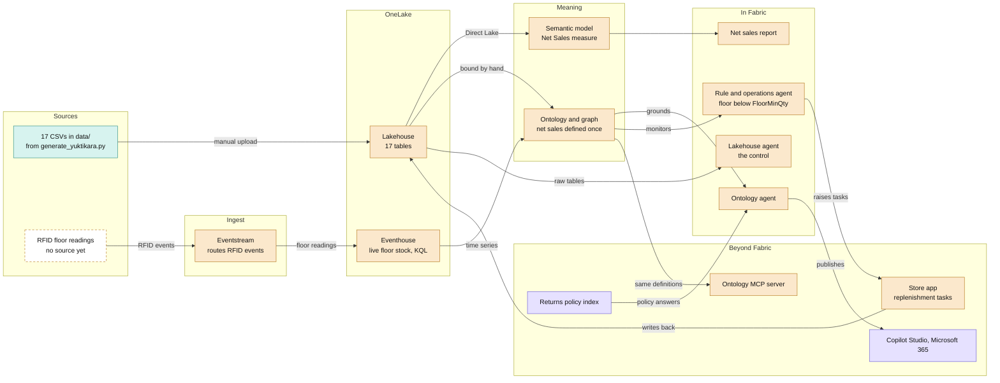
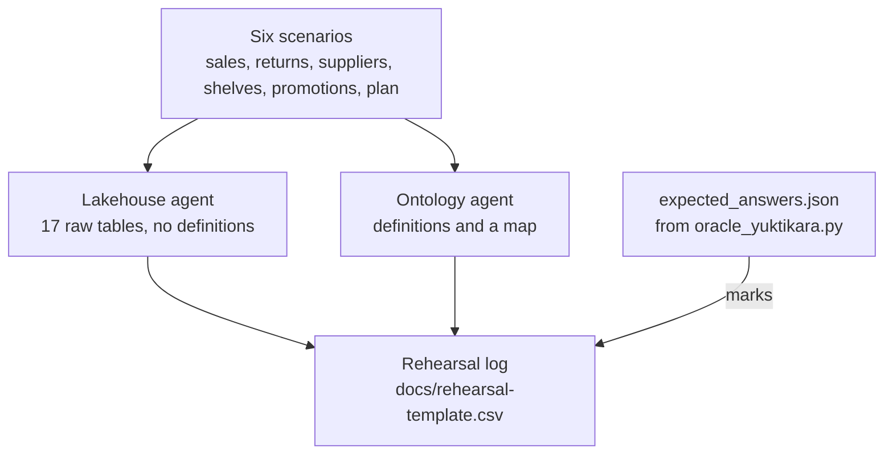

# Architecture

Seventeen tables go into a Fabric lakehouse: the committed snapshot, uploaded to Files and written as typed
tables by the load notebook after you regenerate them for current dates (see the README). They cover what the
business runs on: selling and returns, products and suppliers, buying and deliveries, stock month by month,
promotions and the plan. A semantic model and an ontology give them meaning, and two data agents are put to
the same scenarios so you can see what the ontology adds. A live RFID feed and an operations agent come next.
Publishing beyond Fabric comes last.

## The whole picture

Teal is in this repo today, amber you build in the Fabric portal, and violet needs Azure or extra
licences. A dashed box has nothing behind it yet.

## Components

| Component | Reads from | What it holds | Episode |
|---|---|---|---|
| Lakehouse | The 17 CSVs, uploaded to Files and written as typed tables by `fabric/load_yuktikara_data.ipynb` | The tables in [data-model.md](data-model.md), typed as that page says | 1 |
| Semantic model | Lakehouse, over Direct Lake | Relationships to `DimDate` on `OrderDate` and `ReturnDate`, and a Net Sales measure | 1 |
| Ontology and graph | Lakehouse tables, bound by hand | 15 entity types and 22 relationships: stores, products and variants, customers, orders and lines, returns and reasons, stock now and by month, purchase orders and their lines, promotions and targets | 1 |
| Net sales report | Semantic model | The figure people already trust, which the ontology agent should match | 2 |
| Lakehouse agent | The 17 lakehouse tables, with no definition | The control: joins and money columns worked out per question | 2 |
| Ontology agent | The ontology | The agent under test | 2 |
| Eventstream | RFID readings as they happen | Routes each reading to the eventhouse, with no code between source and destination | 3 |
| Eventhouse | The eventstream | Live floor quantity for RFID-tagged variants (footwear and apparel) at the 18 physical stores | 3 |
| Rule and operations agent | The ontology, with the eventhouse time series | Fires when floor stock drops below `FloorMinQty`, then asks the store in Teams to refill from the backroom | 4 |
| Store app | The operations agent | Replenishment tasks, written back to the lakehouse | 5 |
| Copilot Studio, MCP server | The ontology agent and the ontology | The same definitions, reached from Microsoft 365 and from outside tools | 6 |
| Returns policy index | A returns policy document | Policy answers alongside the ontology agent | 6 |

`StoreInventory.csv` is the batch snapshot of the same stock the RFID feed reports live, so episodes 3 and 4
start from the lakehouse table and add the stream on top.

## Two agents, six scenarios

Both agents read the same data. Only the ontology agent gets the business's definitions and a map of how
things connect. The scenarios reach across the business, so a single well-phrased query rarely covers one:
sales last quarter, why a boot comes back, which supplier is letting us down, which shelves need refilling,
whether the clearance paid, and which stores are behind plan.

The sales one is the definition trap: the question never says "net", and the
[README](../README.md#definitions-the-thing-a-foundation-writes-down) lists the four totals an agent can
land on.

The scenarios that carry the video run three times per agent, the rest once. The log records the answer,
whether it matches the oracle, the definition the agent stated and whether the chat was reset. `expected_answers.json` is only for marking:
never give it to an agent.

## Build order

Episodes 1 to 4 run entirely inside Fabric. Each one adds a layer to the same workspace, so nothing is
rebuilt between episodes.

| Episode | Name | What gets built | Needs | In this repo |
|---|---|---|---|---|
| 1 | Foundation | Lakehouse (17 tables, six business areas), semantic model and ontology, all by hand | A Fabric capacity with the ontology and graph previews on | `data/`, [data-model.md](data-model.md) |
| 2 | Two agents, real scenarios | Lakehouse agent and ontology agent, plus the net sales report, put to six scenarios: sales, returns, supplier reliability, shelf availability, promotions and plan attainment | Fabric only | [rehearsal-template.csv](rehearsal-template.csv), `data/expected_answers.json` |
| 3 | Live floor | RFID readings streamed through an eventstream into an eventhouse, and bound to the ontology as time series | Fabric only | `StoreInventory.csv` as the starting snapshot |
| 4 | Watching agent | One rule on floor stock, and an operations agent that asks in Teams | Fabric, plus Teams | `FloorMinQty` in `StoreInventory.csv` |
| 5 | Store app | An app where managers work through replenishment tasks | To be decided | Nothing yet |
| 6 | One assistant | Publish through Copilot Studio, open the ontology over MCP, add the returns policy index | Azure or extra licences | Nothing yet |

## Open questions

- What produces the RFID stream? Nothing in this repo does yet. An eventstream routes events, but something
  still has to send them, and a sender is code.
- Does "last quarter" mean 2026-Q2, the last complete quarter, or 2026-Q3, which only covers July and August?
- How much of each scenario can the control agent reach with example queries alone? That is what makes the
  comparison fair rather than rigged.
- Which capacity size runs data agents, the ontology and graph together?
- Episode 6 needs a returns policy document, which does not exist yet.
