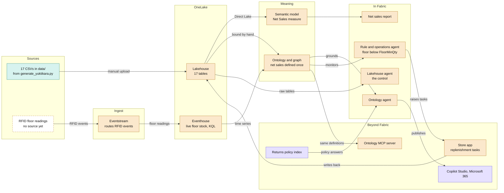
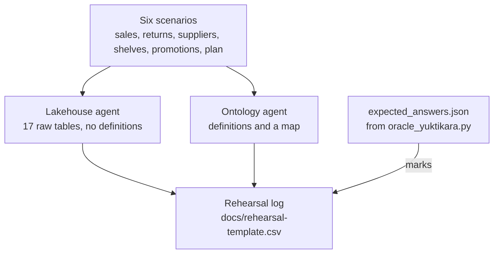

# Architecture

Seventeen tables go into a Fabric lakehouse: the committed snapshot, uploaded to Files and written as typed
tables by the load notebook after you regenerate them for current dates (see the README). They cover what the
business runs on: selling and returns, products and suppliers, buying and deliveries, stock month by month,
promotions and the plan. A semantic model and an ontology give them meaning, and two data agents are put to
the same scenarios so you can see what the ontology adds. A live RFID feed and an operations agent come next.
Publishing beyond Fabric comes last.

## The whole picture

Teal is in this repo today, amber you build in the Fabric portal, and violet needs Azure or extra
licences. A dashed box has nothing behind it yet.

## Components

| Component | Reads from | What it holds | Episode |
|---|---|---|---|
| Lakehouse | The 17 CSVs, uploaded to Files and written as typed tables by `fabric/load_yuktikara_data.ipynb` | The tables in [data-model.md](ep1/02-data-model.md), typed as that page says | 1 |
| Semantic model | Lakehouse, over Direct Lake | Relationships to `DimDate` on `OrderDate` and `ReturnDate`, and the business's measures, Net Sales first | 2 |
| Ontology and graph | Lakehouse tables, bound by hand | 15 entity types and 22 relationships: stores, products and variants, customers, orders and lines, returns and reasons, stock now and by month, purchase orders and their lines, promotions and targets | 1 |
| Net sales report | Semantic model | The figure people already trust, which the ontology agent should match | 2 |
| Lakehouse agent | The 17 lakehouse tables, with no definition | The control: joins and money columns worked out per question | 2 |
| Ontology agent | The ontology | The agent under test | 2 |
| Eventstream | RFID readings as they happen | Routes each reading to the eventhouse, with no code between source and destination | 3 |
| Eventhouse | The eventstream | Live floor quantity for RFID-tagged variants (footwear and apparel) at the 18 physical stores | 3 |
| Rule and operations agent | The ontology, with the eventhouse time series | Fires when floor stock drops below `FloorMinQty`, then asks the store in Teams to refill from the backroom | 4 |
| Store app | The operations agent | Replenishment tasks, written back to the lakehouse | 5 |
| Copilot Studio, MCP server | The ontology agent and the ontology | The same definitions, reached from Microsoft 365 and from outside tools | 6 |
| Returns policy index | A returns policy document | Policy answers alongside the ontology agent | 6 |

`StoreInventory.csv` is the batch snapshot of the same stock the RFID feed reports live, so episodes 3 and 4
start from the lakehouse table and add the stream on top.

## Two agents, six scenarios

Both agents read the same data. Only the ontology agent gets the business's definitions and a map of how
things connect. The scenarios reach across the business, so a single well-phrased query rarely covers one:
sales last quarter, why a boot comes back, which supplier is letting us down, which shelves need refilling,
whether the clearance paid, and which stores are behind plan.

The sales one is the definition trap: the question never says "net", and the
[README](../README.md#definitions-the-thing-a-foundation-writes-down) lists the four totals an agent can
land on.

The scenarios that carry the video run three times per agent, the rest once. The log records the answer,
whether it matches the oracle, the definition the agent stated and whether the chat was reset. `expected_answers.json` is only for marking:
never give it to an agent.

## Build order

Episodes 1 to 4 run entirely inside Fabric. Each one adds a layer to the same workspace, so nothing is
rebuilt between episodes.

| Episode | Name | What gets built | Needs | In this repo |
|---|---|---|---|---|
| 1 | Foundation | Workspace, lakehouse (17 tables, six business areas), ontology and graph, all by hand | A Fabric capacity with the ontology and graph previews on | `data/`, [data-model.md](ep1/02-data-model.md) |
| 2 | Two agents, real scenarios | The semantic model and net sales report, then the lakehouse agent and ontology agent, put to six scenarios: sales, returns, supplier reliability, shelf availability, promotions and plan attainment | Fabric only | [rehearsal-template.csv](rehearsal-template.csv), `data/expected_answers.json` |
| 3 | Live floor | RFID readings streamed through an eventstream into an eventhouse, and bound to the ontology as time series | Fabric only | `StoreInventory.csv` as the starting snapshot |
| 4 | Watching agent | One rule on floor stock, and an operations agent that asks in Teams | Fabric, plus Teams | `FloorMinQty` in `StoreInventory.csv` |
| 5 | Store app | An app where managers work through replenishment tasks | To be decided | Nothing yet |
| 6 | One assistant | Publish through Copilot Studio, open the ontology over MCP, add the returns policy index | Azure or extra licences | Nothing yet |

## Task flow

A task flow is a diagram at the top of the workspace. It shows how the items work together, and selecting a
task filters the item list to that task's items. Build it once, in Episode 1, **with a task for every
episode**. Future tasks stay empty until their episode fills them, so the canvas doubles as the roadmap.
Episode 6 (Copilot Studio and MCP) runs outside the workspace, so it gets no task.

Building it (Microsoft Learn, *Set up a task flow* and *Work with task flows*):

1. Open the workspace in **List view**. In the empty task flow area, select **Add a task** and pick the
   first task type. Starting from **Select a predesigned task flow** also works, but you would rename and
   rearrange most of it.
2. Select the task, then **Edit**, and set its name and description from the table below. **Save**.
3. Add the remaining tasks from the **Add** dropdown on the canvas. Drag them into place.
4. **Connect as you go.** Drag from the edge of one task to the next, or use **Add → Connector**. A known
   issue moves any *unconnected* task back to its default position when you add a new task.
5. Assign items: select the task's clip icon, then **Assign item**, tick the items, then **Select**. An
   item belongs to one task at most. Create items inside their folder first, then assign them, so each
   item has both a folder and a task. **Do this the moment each item exists**, not as a batch at the end —
   assign the lakehouse right after you create it, the notebook right after you import it, and so on. The
   item list then stays organised through the whole build instead of needing a tidy-up pass afterward.
6. Name the flow `Yuktikara Store platform`, from the name menu at the top left of the canvas. The flow
   takes a name only, no description.

| # | Task name | Task type | Items | Episode |
|---:|---|---|---|---|
| 1 | Load data | Get data | `load_yuktikara_data` | 1 |
| 2 | Lakehouse | Store data | `yuktikara_lh` | 1 |
| 3 | Sales model | Visualize data | `Yuktikara Sales` and the net sales report. Created empty in Episode 1 | 2 |
| 4 | Ontology | General | `Yuktikara_Ontology` and its graph model | 1 |
| 5 | Data agents | Analyze and train data | The two agents | 2 |
| 6 | RFID floor feed | Track data | Eventstream, eventhouse, KQL database | 3 |
| 7 | Floor watch | Track data | The operations agent | 4 |
| 8 | Store app | Develop data | The store app | 5 |

Connectors: **1 → 2**, **2 → 3**, **2 → 4**, **4 → 5**, **6 → 4** (the live feed binds to the ontology as a
time series), **4 → 7**, **7 → 8**. Connectors are drawings only. They don't move data or create
connections.

Task descriptions to paste:

| Task | Description |
|---|---|
| Load data | Writes the uploaded CSVs as lakehouse tables with explicit column types, then checks them. The one notebook in an otherwise hand-built series, and it only loads. |
| Lakehouse | Raw CSVs per run under Files; typed Delta tables in the sales, product, store, customer and shared schemas. |
| Sales model | Direct Lake semantic model with the Net Sales measure: the figure people already trust. |
| Ontology | Entity types, relationships and bindings that describe the business, and the graph built from them. |
| Data agents | Two agents asked the same questions: one on lakehouse tables, one on the ontology. |
| RFID floor feed | Live floor stock readings from RFID-tagged items in the 18 physical stores. |
| Floor watch | An operations agent that spots floor stock below its minimum and asks the store to refill. |
| Store app | Where store managers work through replenishment tasks. |

The task type sets the item types Fabric suggests under **+ New item** on that task. It doesn't limit what
you can assign: under **Display**, switch from *Recommended items* to *All items* to see every type.

**Save the flow to the repo.** Select the canvas, then the **Import and export task flow** icon, then
**Export**, and commit the file as `fabric/task-flow.json`. The export keeps the names, descriptions and
connectors but not the item assignments, so anyone can import the same flow and assign their own items.

Two more one-time settings, done as each thing they apply to is built:

- **Promote the semantic model** (**Settings → Endorsement → Promoted**) once its Net Sales measure matches
  the run's `expected_answers.json`. Promotion marks it as the trusted figure, which is its job in the series.
- **Sensitivity labels** need Microsoft Purview Information Protection in the tenant. Skip them if the tenant
  has none: all the data is synthetic.

## What this build follows, and what it skips

Followed:

| Practice | How Yuktikara meets it |
|---|---|
| Every workspace sits on a Fabric capacity | On a trial capacity for Episode 1, a paid F2 from Episode 2 |
| Every workspace has a description | [workspace-setup.md](ep1/01-workspace-setup.md) |
| Names follow a convention, with the environment in them | `Yuktikara Retail - Demo` |
| Capacity use is visible | The Capacity Metrics app, installed before Episode 1: it's the only ongoing view of what the graph and Spark cost, on the trial or on a paid capacity |
| Trusted content is endorsed | The semantic model is promoted, in Episode 2 |
| Non-production capacity is paused when idle | A trial can't be paused, it just runs down its 60 days; once you're on the F2 from Episode 2, pause it after every session |
| No secrets in notebooks | The load notebook holds none |
| No inline `%pip install` | The notebook and scripts use only the Python standard library and Spark |
| No hard-coded `abfss://` paths or GUIDs | Paths are relative to the default lakehouse |
| Write Delta, not Parquet or CSV | Every table is written as Delta |

Skipped on purpose:

| Practice | Why not here |
|---|---|
| A workspace per medallion layer | One author, one synthetic source; see [workspace-setup.md](ep1/01-workspace-setup.md) |
| Git integration | Item definitions carry the workspace's and lakehouse's IDs, and this repo is public. For version history, connect a separate **private** repo |
| Deployment pipelines, from dev to test to prod | A second stage would need a second ontology, and each graph uses capacity while it runs, which an F2 can't spare |
| At least two workspace admins | This is a one-person demo, not production |

## Open questions

- What produces the RFID stream? Nothing in this repo does yet. An eventstream routes events, but something
  still has to send them, and a sender is code.
- Does "last quarter" mean 2026-Q2, the last complete quarter, or 2026-Q3, which only covers July and August?
- How much of each scenario can the control agent reach with example queries alone? That is what makes the
  comparison fair rather than rigged.
- Which capacity size runs data agents, the ontology and graph together?
- Episode 6 needs a returns policy document, which does not exist yet.

## Sources

Microsoft Learn, checked 2026-09-23:

- [Task flows overview](https://learn.microsoft.com/fabric/fundamentals/task-flow-overview), [Set up a task flow](https://learn.microsoft.com/fabric/fundamentals/task-flow-create), [Work with task flows](https://learn.microsoft.com/fabric/fundamentals/task-flow-work-with)
- [Git integration process](https://learn.microsoft.com/fabric/cicd/git-integration/git-integration-process): why item definitions block Git on a public repo
